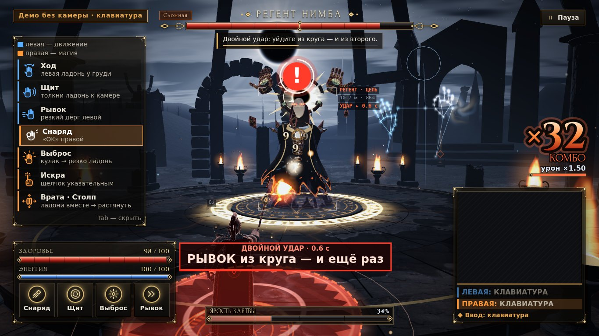
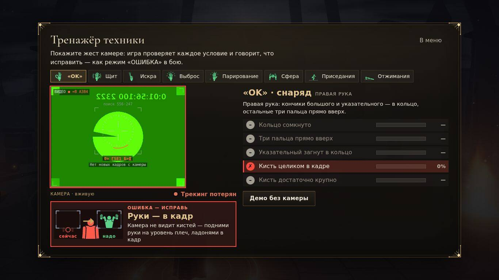
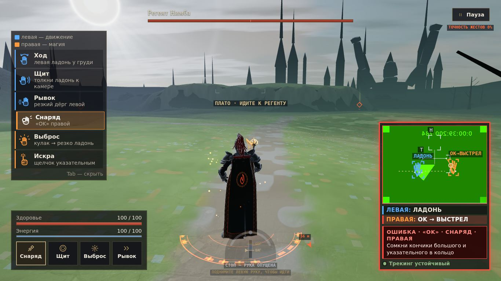
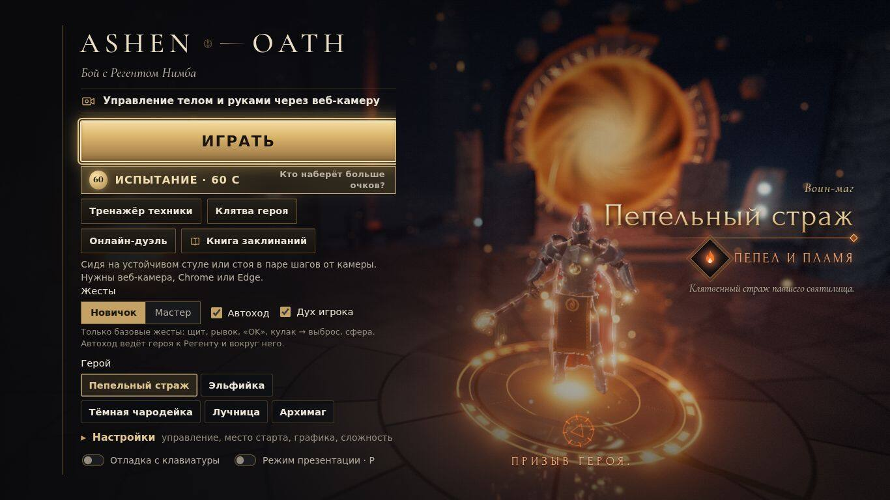
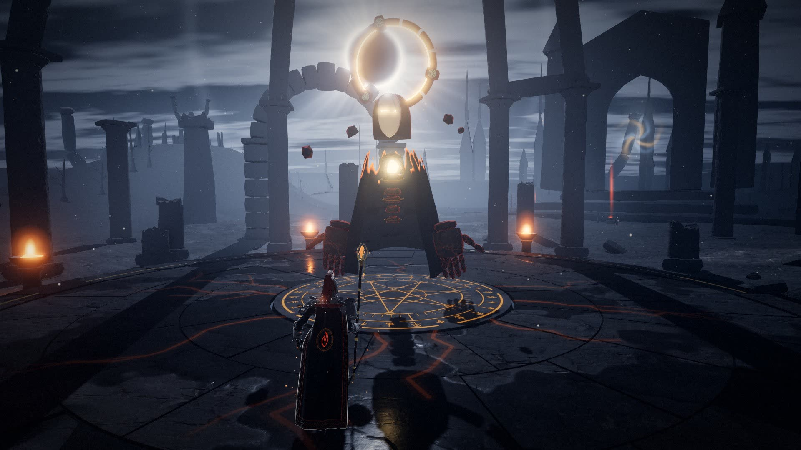
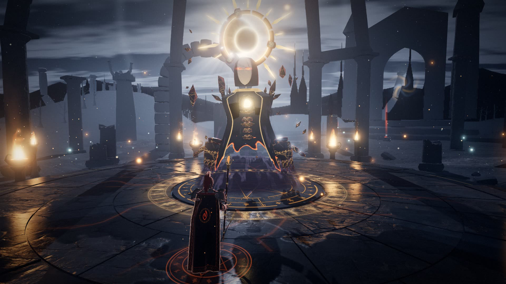

# ASHEN OATH — камера вместо джойстика

Браузерная 3D action-RPG, где джойстик — это вы. Левая рука ведёт героя, правая колдует, двумя руками лепишь сферу и растягиваешь «Врата бури», а когда шкала ярости полна, поднимаешь обе руки и обрушиваешь на босса «Небесный суд». Нужны только ноутбук и веб-камера, устанавливать ничего не надо.

**ADMIT Hackathon · кейс «Motion» · финал**

| | |
|---|---|
| ▶ **Играть (деплой)** | **https://diiaanns07-droid.github.io/ADMIT_STUTU/** — Chrome или Edge, любая веб-камера |
| 🎴 **Презентация** | [PDF, 12 слайдов](https://github.com/diiaanns07-droid/ADMIT_STUTU/raw/main/pitch/ASHEN_OATH_pitch.pdf) · [онлайн](https://diiaanns07-droid.github.io/ADMIT_STUTU/pitch/) · [HTML одним файлом](https://diiaanns07-droid.github.io/ADMIT_STUTU/pitch/ASHEN_OATH_pitch.html) (картинки внутри, сохраняется через Ctrl+S) |
| 🎬 **Запасное видео демо** | [70 с: бой, магия руками, «Дух игрока», «Небесный суд», тренер «ОШИБКА», «Кошмар»](https://diiaanns07-droid.github.io/ADMIT_STUTU/docs/video/ASHEN_OATH_demo_backup.mp4) |
| 📖 **Подробная инструкция** | [README_RU.md](README_RU.md) — все жесты, тренировки, дуэль, решение проблем |

---

## 30 секунд для жюри

- **Что это.** Бой с боссом Регентом Нимба. Героем управляют руки и тело через веб-камеру: MediaPipe находит точки кисти и тела, а 24 жеста, бой и режим «ОШИБКА» — наш код. 5 героев, 5 режимов, 4 уровня сложности. Игра работает офлайн, а видео с камеры не покидает браузер.
- **Режим «ОШИБКА».** Игра не пишет «жест не распознан». Она находит конкретную причину и говорит, как её исправить, — карточкой, подсветкой точек и голосом. Всего 63 подсказки.
- **Кульминация.** Шкала «Ярость клятвы» заполнилась → обе руки над головой на 0,8 с → облёт камеры и меч из света: минус 28 % здоровья Регента.
- **После отбора** вход в бой стал короче (6 кликов → 2), добавились режим «Новичок» с автоходом, магия двумя руками, «Небесный суд», голос тренера, «Тренажёр техники», 4 сложности, новая графика, работа без интернета и на слабых ноутбуках. Подробно — в разделе [«Что улучшили после первого этапа»](#что-улучшили-после-первого-этапа).



| 24 жеста | 63 подсказки «ОШИБКА» | 8 Гц | 1256 проверок | 96 % |
|:-:|:-:|:-:|:-:|:-:|
| у каждого своё действие | 49 к рукам и телу + 14 к технике упражнений | при 8 распознаваниях в секунду базовые жесты срабатывают в 83–100 % попыток, ложных 0 (синтетический тест `dev/lowfps.test.mjs`) | строк PASS/ok в 71 наборе автотестов, 0 падений | 5 форм кисти распознано верно на 135 реальных фото HaGRID |

### Попробуйте за минуту

1. Откройте https://diiaanns07-droid.github.io/ADMIT_STUTU/ в Chrome или Edge → **Играть** → разрешите камеру.
2. Сядьте примерно в метре от камеры, плечи и кисти в рамке. Опустите руки на 1,5 с: калибровка пройдёт сама. Дальше «Научись за 60 секунд» → **В бой**.
3. **Теперь ошибитесь.** Сожмите правый кулак на четверть секунды и сразу раскройте. Игра скажет: «Подержи кулак дольше (≈0,5 с), пока кольцо заряда не станет красным». Сделайте правильно — сработает выброс.

Нет камеры? В меню включите **«Отладка с клавиатуры»** → **Играть** → «Продолжить без камеры (демо)». Клавиша **H** по кругу показывает все 49 подсказок «ОШИБКА».

---

## Как играть

| Способ | Что сделать |
|---|---|
| Онлайн | Открыть https://diiaanns07-droid.github.io/ADMIT_STUTU/ → **Играть** → разрешить камеру |
| Windows | Дважды щёлкнуть `START_GAME.cmd`. Нужен Python 3.7+, пакеты не нужны |
| Любая ОС | `python3 serve_game.py`. Сервер слушает только 127.0.0.1, берёт первый свободный порт из 8765–8789 и сам открывает браузер. Флаги: `--port N`, `--no-browser` |
| Без интернета | [Скачать ZIP](https://github.com/diiaanns07-droid/ADMIT_STUTU/archive/refs/heads/main.zip) → распаковать → `START_GAME.cmd` |

**Что нужно:**
- **Браузер:** Chrome или Edge (на Mac — тоже Chrome). Safari и Firefox мы не проверяли.
- **Камера:** любая встроенная веб-камера.
- **Адрес:** страница должна быть открыта по https или localhost. Если открыть `index.html` двойным щелчком, игра попросит запустить `START_GAME.cmd`.
- **Интернет:** нужен только при первом открытии. Все библиотеки и модели лежат в `vendor/`, service worker кэширует игру, со второго раза она запускается без сети.

**Посадка.** Сядьте примерно в метре от камеры, свет спереди, плечи и кисти в рамке-силуэте. Можно играть и стоя.

### Отладка с клавиатуры (без камеры)

| Клавиши | Действие |
|---|---|
| W / A, D / S / Пробел, Q, E | вперёд / поворот / стоп / рывок |
| J / I / K / F / L | огонь «OK» / рассечение / щит / парирование / выброс |
| U | «Искра»; при полной «Ярости» — «Небесный суд» |
| O / P, X / G | сфера / призма, «Врата бури» / «Столп небес» |
| Z, C, V, B / 1–0 | печати / 10 рун |
| **H** | по кругу все 49 подсказок «ОШИБКА» |
| Shift+P, Esc, Tab | режим презентации, пауза, шпаргалка жестов |

Полная раскладка, в том числе для тренировки приседаний, — в [README_RU.md](README_RU.md).

---

## Управление движениями

| Кто | Движение | Действие |
|---|---|---|
| **Левая рука** | ладонь у груди / у плеча / вбок / вниз | шаг / бег / поворот / стоп («Руль», отсчёт от плеч) |
| | резкий дёрг с возвратом | рывок-уклонение: в момент рывка герой неуязвим |
| | толчок ладонью к камере | щит |
| | кулак → резко раскрыть | парирование: снаряд летит обратно |
| **Правая рука** | «OK» (кольцо из большого и указательного) | снаряды |
| | кулак подержать → раскрыть | выброс, сила зависит от заряда |
| | щелчок указательным / взмах ребром ладони | «Искра» / «Рассечение» |
| | нарисовать пальцем ▲ ϟ ○ ★ @ ∞ ^ V ⧗ ℓ | 10 рун: копьё, молния, лечение, метеоры, вихрь и другие |
| | ладонь вверх / «когти» / вниз / кулак | сгусток огня / молнии / льда / земли |
| **Две руки** | ладони друг к другу → толчок | сфера и бросок; треугольник из пальцев — призма |
| | ладони вместе → растянуть в стороны / вверх-вниз | **«Врата бури»** / **«Столп небес»** |
| | хлопок, «Рамка», ▲ и ♥ двумя указательными | печати |
| | левый кулак + правая щепоть → тянуть к уху | лук |
| **Всё тело** | обе руки над головой 0,8 с при полной «Ярости» | **«Небесный суд»** |
| | отжимания, приседания | очки «Клятвы героя» → 7 улучшений героя |

«24 жеста» — это виды движений: 10 рун считаются по одному, печати и магия стихий — каждая одной позицией.

**«Новичок» и «Мастер»** (`core/handGestures.js`, `main.js`):
- **«Новичок»** включён по умолчанию. Работают базовые жесты: ход, щит, рывок, «OK», выброс, сфера и бросок, «Врата бури» и «Столп небес». **«Автоход»** сам ведёт героя к Регенту, игроку остаётся сражаться. Подсказки к выключенным жестам не показываются.
- **«Мастер»** включает все жесты: руны, искру, рассечение, парирование, призму, печати, лук и магию стихий.
- «Небесный суд» работает в обоих режимах. В настройках вместо «Руля» можно выбрать «Джойстик».

---

## Режим «ОШИБКА»

Игра не пишет «жест не распознан». Она называет одну конкретную причину и говорит, как её исправить.

**Как устроено:**
1. `core/handGestures.js` проверяет каждый жест по нескольким геометрическим условиям на 21 точке кисти: расстояния между кончиками пальцев, сгибы суставов, нормаль ладони, скорость, размер кисти в кадре.
2. Если жест явно начат, но одно конкретное условие не выполнено, распознаватель выдаёт **код ошибки** этого условия — первого по важности.
3. Подсказка появляется, когда почти правильная поза держится 0,45 с (для двух рук 0,9 с). Одна и та же подсказка повторяется не чаще раза в 6 с, любые две — не чаще раза в 2,2 с (`core/handGestures.js:261–279`). Правильные жесты подсказок не вызывают — это проверено тестами.
4. `core/gestureCoach.js` превращает код в текст, короткое исправление, пиктограмму «как сейчас → как надо» и подсветку нужных точек на превью камеры (`core/coachOverlay.js`).

**63 подсказки = 49 + 14:**
- **49 к рукам и телу** (`COACH_HINTS`): положение в кадре, руль, «OK», искра, рассечение, выброс, щит, парирование, руны (10 подсказок), сфера и призма, печати и «Врата/Столп», лук, магия, «Небесный суд».
- **14 к технике упражнений:** 8 к приседаниям (`core/squatCounter.js`) и 6 к отжиманиям (`core/pushupCounter.js`).

**Примеры, дословно из кода:**
- «Сомкни кончики большого и указательного в кольцо» (`core/gestureCoach.js:59`)
- «Резко толкни левую ладонь к камере сантиметров на 20 — просто поднятая ладонь щит не ставит» (`core/gestureCoach.js:67`)
- «Подними ОБЕ руки над головой — локти выше плеч» (`core/gestureCoach.js:106`)
- «Колени заваливаются внутрь — разводи их в стороны, по линии носков» (`core/squatCounter.js:35`)

**Где это видно:**
- в бою — карточка «ОШИБКА · жест · рука» на 4,2 с;
- на превью камеры пульсируют точки, которые надо исправить;
- на обучении подсказка появляется прямо под кистью;
- в итогах боя — точность по каждому жесту, три самые частые ошибки и сравнение с прошлым боем.

**Голос.** У каждой из 49 подсказок есть короткая фраза, например «Сомкни кольцо!». Говорит встроенный в браузер `speechSynthesis` русским голосом, без интернета тоже, если в системе есть русский голос. Любая фраза звучит не чаще раза в 2,5 с, одна и та же — раз в 10 с. Включается кнопкой «Голос · V» в меню (в «Отладке с клавиатуры» в бою клавиша V — печать).

**Тренажёр техники** (`modules/techniqueTrainer.js`):
- 8 упражнений: «OK», щит, искра, выброс, парирование, сфера, приседания, отжимания.
- Чек-лист условий с полосками 0–100 % считают те же формулы и пороги, что и в бою. Если в тренажёре всё зелёное, жест засчитается и в бою.
- Без камеры идёт демо «ошибка → исправление».

| Тренажёр техники | Карточка «ОШИБКА» в бою |
|---|---|
|  |  |
| **«ОШИБКА» на обучении** | **Ошибка техники приседания** |
|  |  |

---

## Что улучшили после первого этапа

Сравнение версии отбора (коммит `15298a8`, 30.09) с финальной версией в `main`.

| Показатель | 30.09 | Финал |
|---|---|---|
| Клики до боя (не считая разрешения камеры) | 6 | **2** — «Играть» и «В бой», калибровка проходит сама |
| Жесты | 21 (более 20) | **24**, новые: «Врата бури», «Столп небес», «Небесный суд» |
| Подсказки «ОШИБКА» | 43 + 14 к упражнениям, только текст | **49 + 14 = 63**: пиктограммы, подсветка точек, голос, тренажёр техники |
| Уровни сложности | выбора не было | **4**: «Лёгкая», «Обычная», «Сложная», «Кошмар» |
| Режимы в меню | 3 | **5** |
| Ассеты (`assets/`) | 35,8 МиБ, только модели и текстуры | **10,0 МиБ**: модели и текстуры 8,5, звуки и иконки 1,5 |
| Работа без интернета | библиотеки с CDN | всё в `vendor/` + service worker |
| Наборы автотестов | 32 | **71** |
| Проверки (строки PASS/ok) | 559 | **1256**, 0 падений |
| JS-модули в `core/` и `modules/` | 67 | 100 |

**Волны доработки** (по слияниям в `main`):
- **«Доступнее»**, 02.10, PR #11:
  - режим «Новичок» и автоход;
  - быстрый вход с автокалибровкой;
  - тренажёр «Научись за 60 секунд»;
  - офлайн-режим, сжатие моделей и текстур в 4 раза (35,8 → 8,5 МиБ);
  - пиктограммы «как сейчас → как надо», звук, режим презентации;
  - игра стоя; жесты работают даже при 8–15 распознаваниях в секунду.
- **«Глубже»**, 02.10, PR #24:
  - «Врата бури», «Столп небес» и «Небесный суд»;
  - «Дух игрока» повторяет руки и пальцы игрока;
  - «Испытание · 60 с»;
  - голос тренера;
  - курсор-кисть вместо мыши;
  - приседания засчитываются и без стоп в кадре;
  - кино-сцены Регента.
- **«Красивее»**, 03.10, PR #38: новые Регент и арена; лица, волосы, наряды и позы героинь; эффекты заклинаний и ударов; интерфейс. Бюджет кадра: `tools/visual_budget.mjs` замерил 27 сцен на трёх уровнях качества, превышений нет ([docs/visual-budget.md](docs/visual-budget.md)).
- **«Надёжнее»**, 03–04.10, PR #44 и #47:
  - сложности «Сложная» и «Кошмар»;
  - ступенчатый откат распознавания при сбоях камеры, экран «Что делать» и «Диагностика»;
  - меню и бой загружаются быстрее;
  - смена героя без подвисаний;
  - герои больше не проваливаются в пол, у героинь убран пересвет.
- **Презентация**, PR #45 и #48: светлая версия, PDF.

| Меню: 30.09 → финал | Регент: 02.10 (до волны «Красивее») → финал |
|---|---|
|   |   |

---

## Режимы и сложность

| Режим | Что это |
|---|---|
| **Играть** | калибровка → «Научись за 60 секунд» → бой с Регентом → итоги с точностью жестов |
| **Испытание · 60 с** | одинаковая минута боя для всех: ранг S–D, «Зал славы дня» (топ-10), имя из 3 букв, постер |
| **Тренажёр техники** | чек-лист условий жеста вживую |
| **Клятва героя** | отжимания и приседания с контролем техники → очки → 7 улучшений героя |
| **Онлайн-дуэль** | PvP до 2 побед из 3: через интернет (WebRTC) или в локальной сети |

Ещё в меню: 5 героев (Пепельный страж, Эльфийка, Тёмная чародейка, Лучница, Архимаг), «Книга заклинаний», «Дух игрока», место старта (у арены, Пепельное плато, Сияющий лес).

| | Лёгкая (по умолчанию) | Обычная | Сложная | Кошмар |
|---|---|---|---|---|
| Здоровье Регента | 4 600 | 10 000 | 12 000 | 12 500 |
| Бой «среднего» игрока (замер ботом) | ≈2 мин | ≈3,2 мин | ≈4,5 мин, около 30 % поражений | чаще проигрывает |
| Очки | ×1 | ×1 | ×1,5 | ×2 |

**Что меняется на «Сложной» и «Кошмаре»** (`config.js`, `modules/boss.js`):
- замахи Регента короче, но не короче 0,45 с — честно для игры камерой; вторая стадия начинается раньше;
- новые приёмы: двойной удар, залп сфер веером, связки и финты; Регент бьёт с упреждением — туда, куда идёт герой;
- издали не отстояться: удар ладонью достаёт героя и за ареной, а «нова» бьёт шире;
- «Ярость» копится медленнее, лечение слабее, щит тратит больше энергии;
- только на «Кошмаре» — «Каменный капкан»;
- на экране итогов есть кнопки «Сложнее» и «Полегче».

---

## Как это работает

**Конвейер распознавания:**
```
камера 640×480 (на дискретной видеокарте 960×720), 30 к/с → ImageBitmap
  → Web Worker: MediaPipe Pose (33 точки) + Hands (21 точка на кисть)
  → core/handGestures.js + core/steerStick.js → InputFrame
  → core/handZone.js (лук, магия) + core/ultimate.js («Небесный суд»)
  → modules/combat.js (бой с фиксированным шагом, без DOM) → мир, эффекты, HUD
  → core/gestureCoach.js → карточка «ОШИБКА», подсветка точек, голос
  → core/squatCounter.js / core/pushupCounter.js → очки «Клятвы»
```

Готовых классификаторов жестов нет. Всё, что превращает точки в игру, — наш код: геометрия кисти и позы, машины состояний, распознаватель рун, руль рукой, счётчики упражнений, режим «ОШИБКА».

```
index.html, main.js, config.js   вход, игровой цикл, настройки
core/      жесты, руль, лук и магия, «Небесный суд», упражнения, «ОШИБКА», автоподстройка, HUD
modules/   камера и MediaPipe (vision), мир, бой, босс, эффекты (fx/), интерфейс, герои, дуэль, звук
net/       онлайн-дуэль: PeerJS (WebRTC) и LAN-ретранслятор
vendor/    three 0.185.1, three-vrm, MediaPipe tasks-vision 0.10.35 с моделями, peerjs, шрифты
sw.js, offline.js   офлайн-кэш и докачка моделей, пока открыто меню
pitch/     презентация (HTML и PDF)
dev/       тесты и стенды        tools/   QA, бюджет кадра, видео
```

**Производительность и надёжность:**
- **Качество «Авто»** (`core/perfTuner.js`): держит около 60 к/с — сначала снижает разрешение (до 0,6), потом уровень графики high → medium → low. На дискретной видеокарте берёт точную модель позы, на встроенной — быструю.
- **Частота позы** (`core/visionPlan.js`): на встроенной видеокарте, если поза и кисти вместе считаются дольше 45 мс (2 с подряд), поза в бою считается через кадр, кисти — каждый кадр.
- **Откат при сбоях распознавания** (`modules/vision.js`): воркер на GPU → воркер на CPU → основной поток на GPU → основной поток на CPU. На ступень ниже игра переходит по таймауту, после 3 ошибок подряд или если GPU отвечает реже 3 раз в секунду. Пока камера запускается, графика рисуется облегчённой, чтобы распознаванию хватило видеокарты.
- **Слабая камера:** если на высоком разрешении меньше 20 к/с, игра сама переходит на 640×480.
- **Бюджет кадра:** для каждого уровня качества заданы пределы `visualBudget` в `config.js`; автотест `dev/visualBudget.test.mjs` сверяет с ними замер ([docs/visual-budget.md](docs/visual-budget.md)).
- **Офлайн:** `vendor/` и service worker; манифест кэша проверяется командой `node tools/sw_manifest.mjs --check`.
- **Приватность:** кадры камеры обрабатываются только в браузере и никуда не отправляются; прогресс хранится в `localStorage`.

**Тесты** (Node 22, около 5 минут): 71 набор, 1256 строк PASS/ok, 0 падений. В версии отбора тем же подсчётом — 32 набора и 559 строк.
```bash
export ASHEN_THREE="$PWD/vendor/npm/three@0.185.1/build/three.module.min.js"
for f in tools/qa_node.mjs dev/*.test.mjs dev/*.test.js dev/controls.soak.mjs; do node "$f" || echo "FAIL $f"; done 2>&1 | grep -cE '^\s*(PASS|ok)\b'
```

**Формы кисти на реальных фото** (`dev/handGestures.real.test.mjs`, 135 фото HaGRID): ладонь, кулак, указательный — 100 %; щепоть — 88 %; «V» — 87 %; итого 130 из 135, **96 %**.

**Онлайн-дуэль** (`net/`): через интернет — PeerJS 1.5.5 (WebRTC DataChannel), библиотека грузится только в этом режиме; в локальной сети — `START_ONLINE_HOST.cmd` (со страницы github.io этот режим не работает). Состояние передаётся 20 раз в секунду, движения соперника сглаживаются.

---

## Для live demo

**Адреса для показа:**
- [`?demo&present`](https://diiaanns07-droid.github.io/ADMIT_STUTU/?demo&present) — сразу бой, слева крупная зеркальная камера со скелетом и подписями жестов;
- [`?demo&fury=100`](https://diiaanns07-droid.github.io/ADMIT_STUTU/?demo&fury=100) — бой с полной «Яростью»: «Небесный суд» можно показать сразу;
- `?challenge` — сразу «Испытание · 60 с»; очистить «Зал славы дня» — `?reset-hall`;
- **F3** — панель кадров и блок «ТРЕКИНГ», **P** — режим презентации.

**Если камера подвела:**
- [запасное видео (70 с)](https://diiaanns07-droid.github.io/ADMIT_STUTU/docs/video/ASHEN_OATH_demo_backup.mp4): бой, магия руками, «Дух игрока», «Небесный суд», тренер «ОШИБКА» на приседаниях, «Кошмар». Записано в отладке с клавиатуры.
- Или включите «Отладку с клавиатуры» и покажите подсказки клавишей **H**.

Короткие ролики отдельных функций (записаны 02.10, до обновления графики, без живой камеры): [«Дух игрока»](docs/video/spirit.mp4) · [«Небесный суд»](docs/video/ultimate.mp4). После обновления: [«Кошмар»](docs/video/w5_nightmare.mp4).

---

## Если что-то не так

Если проблема с камерой, экран камеры сам показывает причину и шаги по исправлению. В разделе **«Диагностика»** есть кнопка **«Скопировать отчёт»**: текст без видео — браузер, распознавание, железо.

| Проблема | Что сделать |
|---|---|
| Долгая «Загрузка…» | Полоса показывает, что грузится. На медленной сети подождите: второй запуск мгновенный. Ошибка про WebGL — включите аппаратное ускорение в настройках браузера |
| «Доступ к камере запрещён» | Значок камеры или замка слева от адреса → Камера → Разрешить, затем «Повторить» |
| «Камера занята» | Закройте Zoom, Teams, OBS и другие вкладки с камерой, затем «Повторить» |
| Жест не распознаётся | Вся кисть в кадре, свет спереди. Какое условие не выполнено, видно в «Тренажёре техники» |
| Герой идёт или поворачивает сам | Опустите левую руку на колени и поднимите снова 2–3 раза: игра запомнит ваше «прямо» |
| Тормозит или трекинг теряется | Оставьте качество «Авто». **F3** покажет, что не успевает. Добавьте света: при меньше 20 к/с с камеры кадры смазаны |

Полная таблица проблем и инструкция по дуэли — в [README_RU.md](README_RU.md).

---

## Планы развития

- **Казахский язык** — интерфейс, 63 подсказки и голосовые фразы. Тексты уже собраны в `core/gestureCoach.js`, `core/voicePhrases.js` и счётчиках упражнений, поэтому перевод не требует менять логику.
- **Режим учителя для класса** — основа уже есть: «Испытание · 60 с» даёт всем одинаковую минуту боя, а «Зал славы дня» показывает рейтинг.
- **Пилот в школе** — игра работает без установки, офлайн и на слабых ноутбуках; дуэль работает по локальной сети.

---

## Лицензии и благодарности

- **Библиотеки:** three.js (MIT), MediaPipe Tasks Vision (Apache-2.0) с моделями Google, three-vrm (MIT), PeerJS (MIT). Шрифты — OFL.
- **3D-ассеты:** VRoid, Quaternius, KayKit, Poly Haven (CC0).
- **Звук:** собственный, CC0.
- **Тестовые данные:** координаты кистей из фото HaGRID (CC BY-SA 4.0), только в `dev/fixtures`.

Полный список — в [ATTRIBUTION.md](ATTRIBUTION.md).
