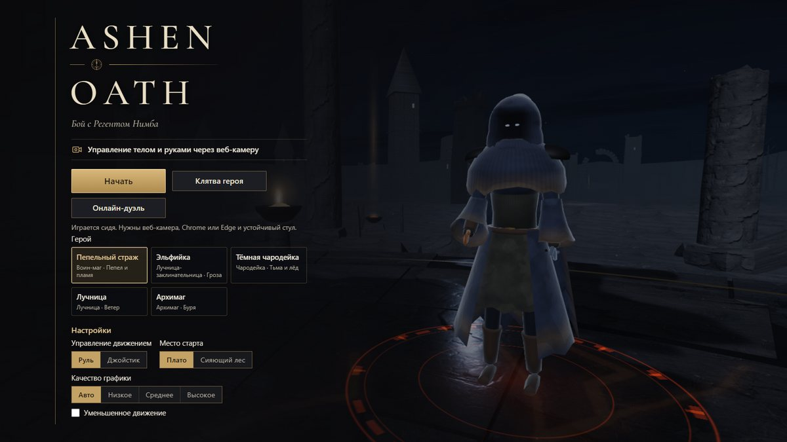
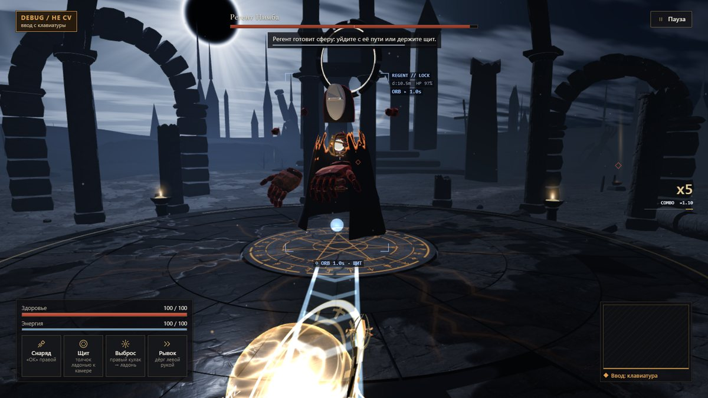

# ASHEN OATH — камера вместо джойстика

**ADMIT Hackathon · кейс «Motion: камера вместо джойстика»** · направление: **игра + фитнес-режим**

Тёмное фэнтези прямо в браузере. Вы сидите перед обычной веб-камерой: **левая рука ведёт героя,
правая колдует**, двумя руками вы лепите сферу и бросаете её в босса — Регента Нимба.
Настоящие **отжимания и приседания** перед камерой прокачивают героя. Клавиатура и мышь в бою
не нужны, устанавливать ничего не надо.

### ▶ Играть: **https://diiaanns07-droid.github.io/ADMIT_STUTU/**
Chrome или Edge и веб-камера. **Работает без интернета:** библиотеки, модели и шрифты лежат в репозитории,
а после первого открытия ссылка запускается и офлайн — на сцене, в школе, на Wi-Fi площадки.
Нет камеры? В меню включите **«Отладка с клавиатуры»**: так можно пройти всю игру.



| Бой: печать «Громовой хлопок» двумя руками | Сфера из ладоней летит в Регента |
|---|---|
|  |  |

---

## Коротко для жюри

| Требование кейса | Как сделано |
|---|---|
| Распознавание в реальном времени, в браузере | MediaPipe Pose + Hands в Web Worker на GPU, 33 точки тела и 21 точка каждой кисти |
| Минимум 3 движения → 3 действия | **Более 20 жестов**: ходьба рукой, рывок, щит, парирование, снаряды, 10 рун пальцем, сфера, печати, лук, магия стихий, отжимания и приседания |
| Понятная обратная связь | Скелет кистей на превью, индикатор «руля», след руны на экране, выноски урона, комбо, карточки «Распознано» на обучении |
| Законченный сценарий | Меню → калибровка → обучение → бой с боссом → **победа или поражение, статистика и точность жестов** |
| Ничего не устанавливать | Статический сайт на GitHub Pages |
| Работает на любой сети | Всё своё в `vendor/` (без CDN), service worker: второй запуск мгновенный и без интернета; модели камеры качаются, пока открыто меню |
| **Твист «ОШИБКА»** | 43 конкретные подсказки к почти правильным жестам, плюс контроль техники приседаний и отжиманий (см. ниже) |
| Бонусы | Своя логика жестов, прокачка и прогресс, онлайн-дуэль, 5 героев, мир 500×500 м, эффекты, автоподстройка под железо |

---

## Сценарий: движение → распознавание → действие → результат

1. **Начать → Разрешить камеру.** Сядьте примерно в метре от камеры: голова, плечи и руки в кадре, свет спереди.
2. **Калибровка** — 2 секунды посидеть ровно, руки опущены.
3. **Обучение** — карточки жестов. Каждый распознанный отмечается «Распознано», а почти правильный показывает, что исправить.
4. **Бой** — идите от плато к арене. Регент просыпается, когда вы входите в круг. Уклоняйтесь, ставьте щит, бейте рунами и чарами.
5. **Итог** — победа или поражение, статистика боя, **точность жестов** и самая частая ошибка с советом.
6. **Клятва героя** — отжимания и приседания перед камерой → очки → 7 улучшений героя.


## Движения и действия

| Жест | Действие |
|---|---|
| Левая ладонь у груди / у плеча / опущена | Шаг / бег (≈1 с ровно — спринт) / стоп |
| Левую руку отвести в сторону | Поворот (в арене — обход Регента по кругу) |
| Резкий дёрг левой рукой с возвратом | Рывок-уклонение, в момент рывка герой неуязвим |
| Левая: толчок раскрытой ладонью к камере | Щит, пока ладонь впереди |
| Левая: кулак → резко раскрыть | Парирование — снаряд Регента летит обратно |
| Правая: «OK» / щелчок указательным / взмах ребром | Снаряды / искра / рассечение |
| Правый кулак подержать → раскрыть | Выброс энергии (сила зависит от заряда) |
| Нарисовать указательным ▲ ϟ ○ ★ @ ∞ ^ V ⧗ ℓ | 10 рун: копьё, молния, лечение, метеоры, вихрь и др. |
| Ладони друг к другу → толчок / треугольник пальцами | Сфера и бросок / призма |
| Хлопок, «Врата», «Рамка»; два указательных рисуют ▲ или ♥ | Печати: волна, бастион, метка, луч, лечение |
| Левый кулак + правая щепоть → тянуть к уху → разжать | Лук: чем сильнее натяжение, тем мощнее стрела |
| Правая ладонь вверх / «когти» / вниз / кулак | Сгусток огня / молнии / льда / земли, толчок — бросок |
| Отжимания, приседания (экран «Тренировка») | Очки клятвы, только за чистые повторы |

Движением героя по умолчанию управляет **«Руль»**: калибровки нет, всё меряется от ваших плеч.
В настройках можно выбрать **«Джойстик»**: поднять левую руку, замереть и вести в любую сторону.

**Новичок и Мастер.** При первом запуске включён режим **«Новичок»**: работают только базовые жесты —
щит, рывок, «OK» (снаряды), кулак → выброс и сфера двумя руками, остальные не мешают. **«Автоход»**
сам ведёт героя к Регенту и вокруг него, так что вы только сражаетесь. **«Мастер»** включает все жесты
и ход левой рукой (переключатель «Жесты» под кнопкой «Начать»). Играть можно сидя или стоя в паре
шагов от камеры. На слабом ноутбуке, где распознавание идёт 8–15 раз в секунду, рывок, щит и
рассечение тоже срабатывают.

## Режим «ОШИБКА» — как реализован

Игра замечает **почти правильное** движение и говорит, что именно исправить. Это не
«жест не распознан», а конкретная причина.

| Тренировка: ошибка техники приседания | Итог боя: точность жестов и частая ошибка |
|---|---|
|  |  |

- **Жесты рук** (`core/handGestures.js`). Каждый жест проверяется по нескольким геометрическим
  условиям на 21 точке кисти: расстояния между кончиками пальцев в «ладонях», сгибы суставов,
  нормаль ладони, скорость, рост кисти в кадре. Если жест явно начат и выполнено всё, кроме
  одного условия, распознаватель выдаёт **код ошибки** именно по этому условию. Подсказка
  срабатывает, только когда «почти-поза» держится 0,45–0,9 с, и повторяется не чаще раза в 6 с.
  Поэтому правильные жесты подсказок не вызывают, и это проверено тестами. Тексты 43 подсказок
  лежат в `core/gestureCoach.js`, например:
  - «OK», кольцо не замкнуто → «Сомкни кончики большого и указательного в кольцо»;
  - щит, ладонь боком → «Разверни левую ладонь к камере»;
  - выброс без заряда → «Подержи кулак дольше, пока кольцо заряда не станет красным»;
  - руна → «Фигура не замкнута — верни палец в точку, откуда начал», «Рисуй крупнее»;
  - сфера → «Поверни ладони друг к другу, будто держишь мяч»;
  - движение → «Рука слишком низко — подними левую руку до груди, чтобы идти»,
    «Поворачивай, отводя левую руку в сторону, а не наклоняя корпус»;
  - кадр → «Кисть у края кадра», «Сядь ближе к камере».
- **Приседания** (`core/squatCounter.js`, 33 точки позы; работает спереди, сбоку и под 45°):
  «Садись глубже — бёдра до параллели», «Колени заваливаются внутрь», «Колени выходят за носки —
  отводи таз назад», «Спина падает вперёд», «Пятки отрываются», «Слишком быстро», «Выпрямись
  полностью», «Отойди — нужно видеть тебя до стоп». В зачёт идут только чистые повторы.
- **Отжимания** (`core/pushupCounter.js`): «Ниже! Плечи почти до кистей», «Таз провисает — тело
  одной линией», «Таз задран», «Слишком быстро», «Кисти должны стоять на полу».
- **Где это видно.** В бою — красная карточка «ОШИБКА · жест · рука». На обучении — такая же
  подсказка под карточками жестов. На экране итогов — **точность жестов** в % и самая частая
  ошибка с советом. На тренировке — карточка ошибки, «Чисто! +1» и итог подхода.
- **Показ без камеры.** В меню включите «Отладка с клавиатуры». В бою клавиша **H** по очереди
  показывает подсказки. На тренировке приседаний: S — присесть, V — колени внутрь,
  G — колени за носки, T — наклон, Shift — быстро.

## Что ещё внутри

- **Мир 500 × 500 м:** арена Регента, нижний город, пепельный лес, озеро, кладбище колоссов,
  холм клятвы, эльфийская деревня с жителями, Сияющий лес. На карте 13 углей клятвы, они дают очки.
- **Пять героев** со своей стихией и анимациями: Пепельный страж, Эльфийка, Тёмная чародейка,
  Лучница, Архимаг. Выбор в меню.
- **Клятва героя** — отжимания и приседания с контролем техники → очки → 7 улучшений.
- **Онлайн-дуэль**: меню → «Онлайн-дуэль», один создаёт комнату, второй вводит код, оба жмут «Готов».
  Бой до 2 побед из 3. Если сеть режет WebRTC, есть режим LAN: у хоста `START_ONLINE_HOST.cmd`.
- **Под любое железо:** качество «Авто» держит ровные ~60 кадров, снижая разрешение и графику.
  На сильной видеокарте включает точную модель позы. **F3** — панель кадров и трекинга.
- **Приватность:** видео обрабатывается только в браузере, не записывается и никуда не отправляется.
  Прогресс хранится в localStorage.

## Запуск

| Способ | Что сделать |
|---|---|
| По ссылке | Открыть https://diiaanns07-droid.github.io/ADMIT_STUTU/ и разрешить камеру |
| Локально (Windows) | Дважды щёлкнуть `START_GAME.cmd` — откроется `http://127.0.0.1:8765/` |
| Локально (любая ОС) | `python serve_game.py` (нужен только Python 3, без пакетов) |
| Без камеры | В меню включить «Отладка с клавиатуры»: W — вперёд, A/D — поворот, S — стоп, H — подсказка «ОШИБКА» |

`index.html` двойным щелчком не откроется: камера и модули работают только через localhost или https.
Деплой — любой статический хостинг, сборка не нужна (GitHub Pages: ветка `main`, папка `/`).
Подробная инструкция для игрока — [`README_RU.md`](README_RU.md).

## Если что-то не так

| Проблема | Решение |
|---|---|
| Долгая «Загрузка…» | Полоса показывает %, что грузится; на медленной сети просто ждать — второй запуск мгновенный. Ошибка — кнопка «Обновить страницу»; включить аппаратное ускорение в браузере |
| Камера запрещена или занята | Значок камеры у адреса → «Разрешить»; закрыть Zoom, Teams, OBS |
| Тормозит | Оставить качество «Авто»; F3 покажет, что не успевает |
| Трекинг теряется | Больше света спереди, плечи и кисти в кадре; F3 → блок «ТРЕКИНГ» |
| Герой идёт или поворачивает сам | Опустить левую руку на колени и поднять снова 2–3 раза — игра запомнит ваше «прямо» |
| Щит или рывок срабатывают сами | Нажать **F8** сразу после сбоя — сохранится запись кистей (без видео) для разбора |

## Технологии и собственная логика

**Three.js 0.185** (сцена, PBR, постобработка) и **MediaPipe Tasks Vision 0.10.35** (поза и кисти
в Web Worker на GPU). Всё, что превращает точки в игру, — собственный код команды, без готовых
классификаторов жестов: геометрия 21 точки кисти и 33 точек позы, машины состояний, распознаватель
рун в стиле $1 с геометрическими проверками, руль и джойстик рукой, счётчики упражнений, режим «ОШИБКА».

```
камера → vision.js (MediaPipe в Worker) → handGestures.js + steerStick.js → InputFrame
       → combat.js (бой, босс) → world / effects / HUD  ·  gestureCoach.js → карточки «ОШИБКА»
       → squatCounter.js / pushupCounter.js → progression.js (очки клятвы)
```

```
index.html, main.js, config.js   вход, игровой цикл, настройки
core/        жесты (handGestures), руль и джойстик (steerStick, leftStick), лук и магия рукой,
             упражнения (squat/pushupCounter), подсказки (gestureCoach), прокачка, автоподстройка, HUD
modules/     камера и MediaPipe (vision), мир, бой, босс, эффекты (fx/), интерфейс, герои, дуэль
net/         онлайн: WebRTC (PeerJS), LAN-ретранслятор
vendor/      свои копии three, three-vrm, MediaPipe (WASM, модели), шрифтов, peerjs — tools/vendor_update.mjs
sw.js, offline.js  офлайн-кэш (service worker) и предзагрузка MediaPipe в меню — tools/sw_manifest.mjs
dev/         тесты (*.test.mjs) и стенды (*.html)      tools/   QA и снимки
```

**Тесты:** `node tools/qa_node.mjs` и `node dev/<набор>.test.mjs`. В `dev/` около 30 наборов:
жесты, руль, приседания, отжимания, бой, сеть и другие. Браузерный QA — `node tools/qa_browser.mjs`;
без интернета — `node dev/offline.browser.mjs` (первый запуск → сеть пропала → перезагрузка).

## Лицензии

Сторонние библиотеки, модели и CC0-ассеты перечислены в [`ATTRIBUTION.md`](ATTRIBUTION.md).
