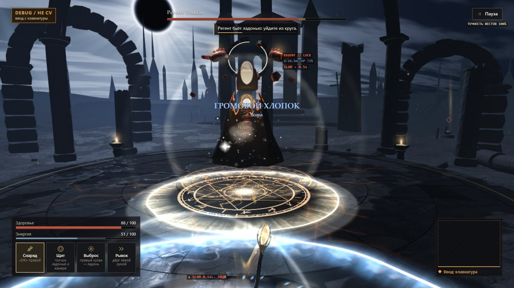
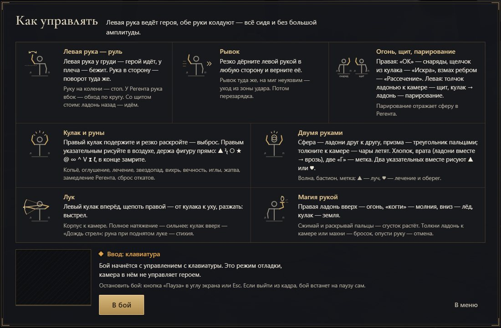
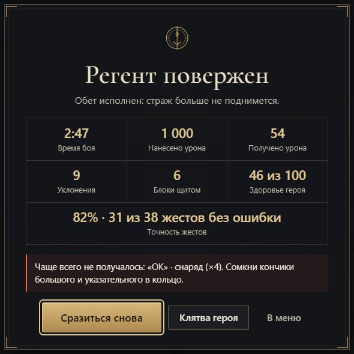
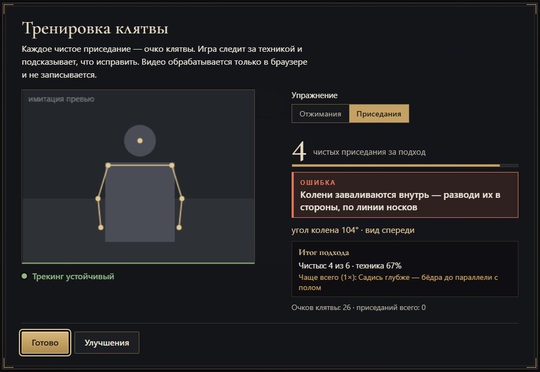
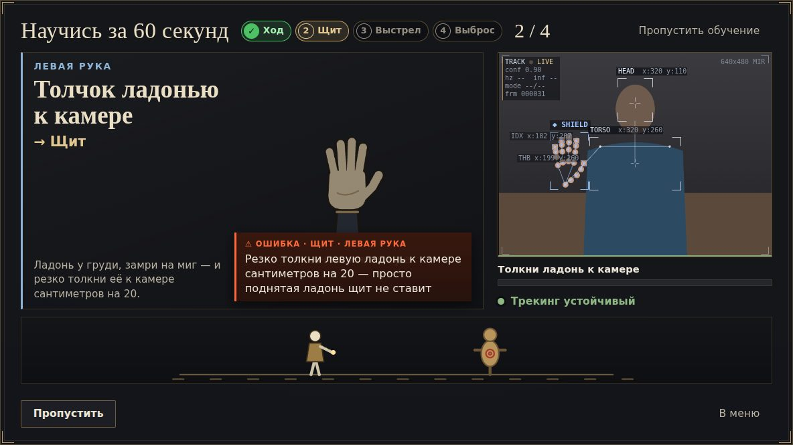
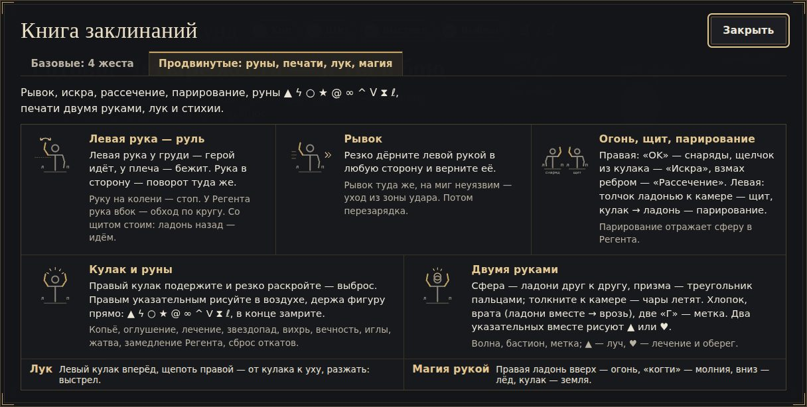

# ASHEN OATH — камера вместо джойстика

**ADMIT Hackathon · кейс «Motion: камера вместо джойстика»** · игра + фитнес-режим

Тёмное фэнтези в браузере. **Левая рука ведёт героя, правая колдует, двумя руками** вы лепите сферу
и бросаете её в босса. Нужны только ноутбук и веб-камера, ставить ничего не надо.

## ⏱ 30 секунд для жюри

### ▶ Играть: **[diiaanns07-droid.github.io/ADMIT_STUTU](https://diiaanns07-droid.github.io/ADMIT_STUTU/)**
Chrome или Edge и веб-камера. **Работает без интернета:** библиотеки, модели и шрифты лежат в репозитории,
а после первого открытия ссылка запускается и офлайн — на сцене, в школе, на Wi-Fi площадки.

1. **Играть → «Разрешить» камеру.** Сядьте в метре от камеры: плечи и кисти — в рамке-силуэте, она станет зелёной.
   Руки вниз, 1,5 секунды не двигаться — калибровка пройдёт сама.
2. **Тренажёр «Научись за 60 секунд»:** повторяйте жест с картинки — на каждом шаге крупное «✓ Распознано!».
   Последний шаг — правый кулак подержать полсекунды и резко раскрыть: выброс.
3. **Теперь ошибитесь:** сожмите кулак на четверть секунды и сразу раскройте. Игра скажет, что исправить:
   **«Ошибка · Выброс · правая рука — Подержи кулак дольше (≈0,5 с), пока кольцо заряда не станет красным»**.
   Ещё нагляднее — меню → **«Тренажёр техники»** → «OK»: чек-лист условий жеста загорается вживую.
   Затем **«В бой»**: в режиме «Новичок» герой сам идёт к Регенту, вы только сражаетесь.

Нет камеры? В меню включите **«Отладка с клавиатуры»**: W — бег вперёд, L — выброс, H — показать подсказку «ОШИБКА»,
U при полной шкале «Ярость клятвы» — «Небесный суд».

**Кульминация боя — «Небесный суд».** Попадания, серии, идеальные уклонения и парирования копят шкалу
«Ярость клятвы» (внизу по центру). Полная шкала пульсирует, и игра крупно зовёт **«ПОДНИМИ ОБЕ РУКИ!»**:
обе руки над головой (запястья выше носа, локти выше плеч) — и держать 0,8 с, кольцо у фигурки заполняется.
Работает и в «Новичке». Дальше 3,6 с кино: замедление, камера облетает героя и поднимается, чёрные полосы,
небо раскалывается, на Регента падает меч из света — минус 28 % его здоровья. Подняли одну руку — «ОШИБКА:
подними ОБЕ руки», опустили рано — «держи руки вверху ещё секунду». Показать сразу: адрес с **`?fury=100`**
(например `?demo&fury=100`) — бой начинается с полной шкалой.

🏆 **Посоревнуйтесь:** меню → **«Испытание · 60 с»** (или адрес **`?challenge`**) — одинаковая минута боя для каждого:
очки, ранг S–D, своё имя из 3 букв в «Зале славы дня» и постер-картинка с вашим скелетом в момент последнего удара.
Перед финалом зал очищается адресом **`?reset-hall`**.



| 24 жеста | 63 подсказки «ОШИБКА» | 1050+ проверок | 96 % | 0 кадров в сеть |
|:-:|:-:|:-:|:-:|:-:|
| у каждого своё действие | 49 к рукам и телу (жесты и кадр), 14 к технике упражнений | в 59 наборах автотестов, 0 падений | формы кисти на 135 реальных фото (HaGRID) | видео обрабатывается только в браузере |

**Новое в финальной версии**
- **«Врата бури» и «Столп небес»** — сомкни ладони и растяни: в стороны — волна огня и молний, вверх-вниз — столп света с неба. Работает и в «Новичке».
- **«Небесный суд»** — шкала «Ярость клятвы» полна → обе руки над головой: облёт камеры и меч из света.
- **«Дух игрока»** — огромный дух из света над ареной повторяет плечи, локти, кисти и все пальцы игрока в реальном времени.
- **«Испытание · 60 с»** — одна минута для всех, ранг S–D, «Зал славы дня» и постер победы картинкой.
- **Голос тренера** — подсказки «ОШИБКА» звучат вслух (клавиша V), диктор объявляет заклинания.
- **Без мыши** — курсор-кисть: кнопки меню, паузы и итогов нажимаются указательным пальцем.
- **Кинокартинка** — гроза и ярость Регента во второй фазе, его гибель на осколки, импульсы экрана от ударов.
- **Приседания у живого человека** — мягкий зачёт в «Новичке», подсчёт без стоп в кадре, подготовка и диагностика.

**Что улучшили после первого этапа** (387 коммитов, сравнение с версией на 30 сентября)

| | Первый этап | Финал |
|---|---|---|
| Вход для новичка | Сразу все 20 жестов, калибровка по кнопке | Режим «Новичок» (5 базовых жестов и автоход), тренажёр «Научись за 60 секунд», калибровка сама по зелёному силуэту, «Книга заклинаний» |
| Режим «ОШИБКА» | 43 текстовые подсказки | 63 подсказки, пиктограмма «как сейчас → как надо», подсветка точек на превью, голос тренера, «Тренажёр техники» с чек-листом условий, в итогах — точность по каждому жесту, топ-3 ошибок и сравнение с прошлым боем |
| Движения | 20 жестов | 24: «Врата бури», «Столп небес» и ультимейт всем телом «Небесный суд» |
| Управление меню | Мышь | Курсор-кисть: палец наводит, задержка или щепоть нажимает |
| Зрелищность | Бой с боссом | Кино-финал Регента, гроза во второй фазе, «Дух игрока» повторяет руки и пальцы |
| Графика | Первая версия моделей и эффектов | Волна 4: Регент из обсидиана с золотом и короной-затмением; лица, волосы и наряды героинь с живой тканью; арена с огнём и мокрым полом; заклинания читаются с 5 м; интерфейс в стиле RPG |
| Реиграбельность | — | «Испытание · 60 с»: ранг S–D, «Зал славы дня», постер победы |
| Фитнес | Приседания по строгим порогам | Приседания у живого человека: мягкий зачёт в «Новичке», подсчёт без стоп в кадре |
| Надёжность | Библиотеки и модели с CDN | Всё в репозитории, работает без интернета после первого запуска (service worker) |
| Тесты | 31 набор | 59 наборов, больше 1050 проверок; бюджет кадра — тоже автотестом |

🎴 **Презентация:** [PDF](pitch/ASHEN_OATH_pitch.pdf) · [онлайн](https://diiaanns07-droid.github.io/ADMIT_STUTU/pitch/) · офлайн — `python3 serve_game.py` → `/pitch/` · [прежняя версия](pitch/v1.html)
(← → листать, F — полный экран).

---

## Требования кейса → как сделано

| Требование кейса | Как сделано |
|---|---|
| Распознавание в реальном времени, в браузере | MediaPipe Pose + Hands в Web Worker на GPU, 33 точки тела и 21 точка каждой кисти |
| Минимум 3 движения → 3 действия | **24 жеста, у каждого своё действие**: ходьба рукой, рывок, щит, парирование, снаряды, 10 рун пальцем, сфера, «Врата бури» и «Столп небес», печати, лук, магия стихий, «Небесный суд» всем телом (обе руки над головой), отжимания и приседания |
| Понятная обратная связь | Скелет кистей на превью, индикатор «руля», след руны на экране, выноски урона, комбо, тренажёр «Научись за 60 секунд» с крупным «✓ Распознано!» на каждом шаге |
| Законченный сценарий | Меню → калибровка → обучение → бой с боссом → **победа или поражение, статистика и точность жестов** |
| Ничего не устанавливать | Статический сайт на GitHub Pages |
| Работает на любой сети | Всё своё в `vendor/` (без CDN), service worker: второй запуск мгновенный и без интернета; модели камеры качаются, пока открыто меню |
| **Твист «ОШИБКА»** | 49 подсказок к почти правильным жестам (и к «Небесному суду» всем телом) и к положению кистей в кадре — с пиктограммой «как сейчас → как надо» и подсветкой нужных точек на превью камеры, плюс 14 ошибок техники приседаний и отжиманий; **«Тренажёр техники»** — чек-лист условий жеста вживую; итог боя — точность по каждому жесту, топ-3 ошибок и сравнение с прошлым боем (см. ниже) |
| Бонусы | Своя логика жестов, прокачка и прогресс, онлайн-дуэль, 5 героев, мир 500×500 м, эффекты, автоподстройка под железо |

---

## Сценарий: движение → распознавание → действие → результат

0. **Твист «ОШИБКА» за 20 секунд:** меню → **«Тренажёр техники»** → выбрать «OK» и показать правую руку.
   Чек-лист условий загорается вживую (✓/✗ и полоски), первое невыполненное условие — крупно, с пиктограммой и советом;
   всё зелёное — «Идеально!». Пока включается камера, там же идёт демо.
1. **Играть** (браузер спросит камеру — «Разрешить»). Сядьте примерно в метре от камеры: плечи и кисти в рамке-силуэте, свет спереди.
2. **Калибровка — сама**: рамка зелёная, руки вниз, 1,5 секунды не двигаться. Результат запоминается, в следующий раз калибровки нет.
3. **Обучение — «Научись за 60 секунд»**: 4 базовых жеста по одному — левая ладонь у груди (ход), толчок ладонью к камере (щит), правая «OK» (выстрел), кулак → раскрыть (выброс). Крупная анимированная кисть рядом с превью камеры, «✓ Распознано!», реакция манекена и автопереход; почти правильный жест — подсказка «ОШИБКА» прямо под кистью. Остальные жесты — в «Книге заклинаний» (меню и пауза).
4. **Бой** — **В бой**: герой сразу на краю арены, короткое интро (пропуск — любая клавиша, клик или жест), первый удар — через пару секунд. Уклоняйтесь, ставьте щит, бейте рунами и чарами. Прогулка от плато — «Место старта: Плато» в меню. Для показа на сцене — адрес с **`?demo`**: сразу камера → бой, без меню.
5. **Итог** — победа или поражение, статистика боя, **точность по каждому жесту** столбиками, три самые частые ошибки с советами и сравнение с прошлым боем.
6. **Клятва героя** — отжимания и приседания перед камерой → очки → 7 улучшений героя.



## Движения и действия

| Жест | Действие |
|---|---|
| Левая ладонь у груди / у плеча / опущена | Шаг / бег (≈1 с ровно — спринт) / стоп |
| Левую руку отвести в сторону | Поворот (в арене — обход Регента по кругу) |
| Резкий дёрг левой рукой с возвратом | Рывок-уклонение, в момент рывка герой неуязвим |
| Левая: толчок раскрытой ладонью к камере | Щит, пока ладонь впереди |
| Левая: кулак → резко раскрыть | Парирование — снаряд Регента летит обратно |
| Правая: «OK» / щелчок указательным / взмах ребром | Снаряды / искра / рассечение |
| Правый кулак подержать → раскрыть | Выброс энергии (сила зависит от заряда) |
| Нарисовать указательным ▲ ϟ ○ ★ @ ∞ ^ V ⧗ ℓ | 10 рун: копьё, молния, лечение, метеоры, вихрь и др. |
| Ладони друг к другу → толчок / треугольник пальцами | Сфера и бросок / призма |
| Ладони вместе → растянуть в стороны / вверх-вниз (и в «Новичке») | «Врата бури»: волна к Регенту + бастион / «Столп небес»: удар сверху и оглушение |
| Хлопок, «Рамка»; два указательных рисуют ▲ или ♥ | Печати: волна, метка, луч, лечение |
| Левый кулак + правая щепоть → тянуть к уху → разжать | Лук: чем сильнее натяжение, тем мощнее стрела |
| Правая ладонь вверх / «когти» / вниз / кулак | Сгусток огня / молнии / льда / земли, толчок — бросок |
| Обе руки над головой 0,8 с (шкала «Ярость клятвы» полна) | «Небесный суд»: облёт камеры, меч из света, −28 % здоровья Регента |
| Отжимания, приседания (экран «Тренировка») | Очки клятвы; приседания в «Новичке» — с ~115° и без стоп в кадре, ошибка +1, чисто +2 |

Движением героя по умолчанию управляет **«Руль»**: калибровки нет, всё меряется от ваших плеч.
В настройках можно выбрать **«Джойстик»**: поднять левую руку, замереть и вести в любую сторону.

**Новичок и Мастер.** При первом запуске включён режим **«Новичок»**: работают только базовые жесты —
щит, рывок, «OK» (снаряды), кулак → выброс и сфера двумя руками, остальные не мешают. **«Автоход»**
сам ведёт героя к Регенту и вокруг него, так что вы только сражаетесь. **«Мастер»** включает все жесты
и ход левой рукой (переключатель «Жесты» под кнопкой «Начать»). Играть можно сидя или стоя в паре
шагов от камеры. На слабом ноутбуке, где распознавание идёт 8–15 раз в секунду, рывок, щит и
рассечение тоже срабатывают.

## Режим «ОШИБКА» — как реализован

Игра замечает **почти правильное** движение и говорит, что именно исправить. Это не
«жест не распознан», а конкретная причина.

| Тренажёр техники: чек-лист условий жеста вживую | Бой: карточка «ОШИБКА» с пиктограммой «как сейчас → как надо» |
|---|---|
|  |  |

| Итог боя: точность по жестам, топ-3 ошибок, сравнение с прошлым боем | Тренировка: ошибка техники приседания |
|---|---|
|  |  |

| Обучение: «ОШИБКА» прямо под кистью | «Книга заклинаний»: руны, печати, лук, магия |
|---|---|
|  |  |

- **Жесты рук** (`core/handGestures.js`). Каждый жест проверяется по нескольким геометрическим
  условиям на 21 точке кисти: расстояния между кончиками пальцев в «ладонях», сгибы суставов,
  нормаль ладони, скорость, рост кисти в кадре. Если жест явно начат и выполнено всё, кроме
  одного условия, распознаватель выдаёт **код ошибки** именно по этому условию. Подсказка
  срабатывает, только когда «почти-поза» держится 0,45–0,9 с (у части жестов — дольше или сразу
  по событию), одна и та же повторяется не чаще раза в 6 с, любые две — не чаще раза в 2,2 с. Поэтому правильные жесты подсказок не вызывают, и это проверено тестами. Тексты 49 подсказок
  лежат в `core/gestureCoach.js`, например:
  - «OK», кольцо не замкнуто → «Сомкни кончики большого и указательного в кольцо»;
  - щит, ладонь боком → «Разверни левую ладонь к камере»;
  - выброс без заряда → «Подержи кулак дольше, пока кольцо заряда не станет красным»;
  - руна → «Фигура не замкнута — верни палец в точку, откуда начал», «Рисуй крупнее»;
  - сфера → «Поверни ладони друг к другу, будто держишь мяч»;
  - движение → «Рука слишком низко — подними левую руку до груди, чтобы идти»,
    «Поворачивай, отводя левую руку в сторону, а не наклоняя корпус»;
  - кадр → «Кисть у края кадра», «Сядь ближе к камере».
- **Приседания** (`core/squatCounter.js`, 33 точки позы; работает спереди, сбоку и под 45°):
  «Садись глубже — бёдра до параллели», «Колени заваливаются внутрь», «Колени выходят за носки —
  отводи таз назад», «Спина падает вперёд», «Пятки отрываются», «Слишком быстро», «Выпрямись
  полностью», «Отойди — нужно видеть тебя до стоп». В зачёт идут только чистые повторы.
- **Отжимания** (`core/pushupCounter.js`): «Ниже! Плечи почти до кистей», «Таз провисает — тело
  одной линией», «Таз задран», «Слишком быстро», «Слишком долго внизу — повтор не засчитан»,
  «Кисти должны стоять на полу».
- **Тренажёр техники** (`modules/techniqueTrainer.js`, кнопка в меню и на экране итогов). Выбираешь
  жест — «OK», щит, искру, выброс, парирование, сферу, приседания или отжимания — и видишь вживую
  чек-лист его условий с полосками 0–100 %: «кольцо сомкнуто ✓», «три пальца прямо вверх ✗»,
  «ладонь смотрит в камеру ✓», «глубина ✓», «колени по линии носков ✗», «тело одной линией ✓».
  Условия считает сам распознаватель теми же формулами и порогами, что и в бою
  (`checks()` в `core/handGestures.js`, `read().checks` в счётчиках упражнений), поэтому «всё
  зелёное» и «жест распознан» совпадают — это проверено тестами на тысячах синтетических поз.
  Первое невыполненное условие — крупно, с пиктограммой и советом, а на превью камеры
  подсвечены нужные точки. Жест распознан — «Идеально!». Без камеры (и пока она включается)
  синтетическая кисть проходит путь «ошибка → исправление → идеально» через тот же распознаватель.
- **Где ещё это видно.** В бою — крупная карточка «ОШИБКА · жест · рука» слева над панелью героя
  (центр экрана не перекрыт): что исправить, текст подсказки и пиктограмма «как сейчас → как надо»
  (`core/coachPictograms.js`). На превью камеры пульсируют точки, которые надо исправить: у «OK» —
  кончики большого и указательного и линия «СОМКНИ» (`core/coachOverlay.js`, данные —
  `getActiveHint()` из `core/gestureCoach.js`). На обучении — та же подсказка с пиктограммой. На
  экране итогов — точность по каждому жесту столбиками, три самые частые ошибки с советами и
  сравнение с прошлым боем (▲/▼, хранится в localStorage). На тренировке — карточка ошибки,
  «Чисто! +1» и итог подхода.
- **Показ без камеры.** В меню включите «Отладка с клавиатуры». В бою клавиша **H** по очереди
  показывает все подсказки. Шаги обучения проходятся клавишами **W, K, J, L** (H — пример подсказки шага).
  «Тренажёр техники» в отладке сразу идёт в демо. На тренировке
  приседаний: S — присесть, V — колени внутрь, G — колени за носки, T — наклон, Shift — быстро.

## Что ещё внутри

- **Мышь не нужна:** в меню, паузе, на итогах, в «Книге заклинаний» и тренажёре указательный палец
  правой руки — курсор (светящееся кольцо). Задержите его на кнопке 0,8 с — кольцо заполнится и нажмёт,
  или сведите большой и указательный пальцы (щепоть). В бою курсора нет. Если камера уже разрешена,
  меню слушается руки сразу после открытия ссылки; `?cursor=0` — выключить.
- **Мир 500 × 500 м:** арена Регента, нижний город, пепельный лес, озеро, кладбище колоссов,
  холм клятвы, эльфийская деревня с жителями, Сияющий лес. На карте 13 углей клятвы, они дают очки.
- **Пять героев** со своей стихией и анимациями: Пепельный страж, Эльфийка, Тёмная чародейка,
  Лучница, Архимаг. Выбор в меню.
- **Клятва героя** — отжимания и приседания с контролем техники → очки → 7 улучшений.
- **Онлайн-дуэль**: меню → «Онлайн-дуэль», один создаёт комнату, второй вводит код, оба жмут «Готов».
  Бой до 2 побед из 3. Если сеть режет WebRTC, есть режим LAN: у хоста `START_ONLINE_HOST.cmd`.
- **Под любое железо:** качество «Авто» держит ровные ~60 кадров, снижая разрешение и графику.
  На сильной видеокарте включает точную модель позы. **F3** — панель кадров и трекинга.
- **Приватность:** видео обрабатывается только в браузере, не записывается и никуда не отправляется.
  Прогресс хранится в localStorage.

## Запуск

| Способ | Что сделать |
|---|---|
| По ссылке | Открыть https://diiaanns07-droid.github.io/ADMIT_STUTU/ и разрешить камеру |
| Локально (Windows) | Дважды щёлкнуть `START_GAME.cmd` — откроется `http://127.0.0.1:8765/` |
| Локально (любая ОС) | `python serve_game.py` (нужен только Python 3, без пакетов) |
| Без камеры | В меню включить «Отладка с клавиатуры»: W — вперёд, A/D — поворот, S — стоп, H — подсказка «ОШИБКА» |

`index.html` двойным щелчком не откроется: камера и модули работают только через localhost или https.
Деплой — любой статический хостинг, сборка не нужна (GitHub Pages: ветка `main`, папка `/`).
Подробная инструкция для игрока — [`README_RU.md`](README_RU.md).

## Если что-то не так

| Проблема | Решение |
|---|---|
| Долгая «Загрузка…» | Полоса показывает %, что грузится; на медленной сети просто ждать — второй запуск мгновенный. Ошибка — кнопка «Обновить страницу»; включить аппаратное ускорение в браузере |
| Камера запрещена или занята | Значок камеры у адреса → «Разрешить»; закрыть Zoom, Teams, OBS |
| Тормозит | Оставить качество «Авто»; F3 покажет, что не успевает |
| Трекинг теряется | Больше света спереди, плечи и кисти в кадре; F3 → блок «ТРЕКИНГ» |
| Герой идёт или поворачивает сам | Опустить левую руку на колени и поднять снова 2–3 раза — игра запомнит ваше «прямо» |
| Щит или рывок срабатывают сами | Нажать **F8** сразу после сбоя — сохранится запись кистей (без видео) для разбора |

## Бюджет кадра

Визуал растёт, а кадр не должен дорожать незаметно. У каждого уровня качества есть измеримый бюджет
(`config.js` → `visualBudget`), а замер всех сцен — автоматический:

```bash
node tools/visual_budget.mjs                 # все сцены × low/medium/high → docs/visual-budget.md и .json (--jobs 3: уровни параллельно, ~1 ч в облаке)
node dev/visualBudget.test.mjs               # таблица против бюджета: падает, если сцена дороже предела
node tools/visual_budget.mjs --quality low --only menu,burst --out /tmp/vb --compare docs/visual-budget.json   # быстро: своя сцена, «было → стало»
node tools/visual_gallery.mjs --label after  # кадры в тех же ракурсах, что docs/gallery/before/ → docs/gallery/after/ + sheet.jpg
```

Сцены: меню с каждым из 5 героев; бой в «Отладке с клавиатуры» — общий план и каждое заклинание
(J, L, O, X, G, U, руны 1–0); Регент — переход в фазу 2, гроза, удар, «Небесный суд», гибель.
Время в headless — виртуальное (ровно 1/30 с на кадр), случайность — с зерном: прогоны сравнимы кадр в кадр.

| Цифра | Что значит |
|---|---|
| **Вызовы** | draw calls за кадр со всеми проходами (тени, постобработка) — главная цена на CPU и слабых GPU |
| **Треугольники** | сумма за кадр, включая проходы теней |
| **Текстуры / программы** | в памяти GPU; новая программа — компиляция шейдера (рывок при первом показе) |
| **Свет** | видимые источники в сцене, включая погашенные: three всё равно считает их в каждом шейдере (на low новых нет) |
| **Частицы** | вершины Points, спрайты и GPU-частицы эффектов V6 |
| **JS, мс** | медиана времени JS кадра (настоящие часы); **кадр SW** — полное время на программном рендере, справочно |

Бюджет сейчас (`config.js` → `visualBudget`; замер `main` — в [`docs/visual-budget.md`](docs/visual-budget.md)):

| Уровень | Вызовы (меню / бой) | Треугольники (меню / бой) | Свет | Тени | Частицы | JS, мс |
|---|---:|---:|---:|---:|---:|---:|
| low | 240 / 350 | 480 тыс. / 480 тыс. | 6 | 0 | 2300 | 50 |
| medium | 630 / 540 | 1,44 млн / 810 тыс. | 12 | 1 | 4200 | 50 |
| high | 820 / 790 | 2,17 млн / 1,5 млн | 18 | 1 | 6100 | 70 |

База для сравнения «до/после» — [`docs/gallery/before/`](docs/gallery/before/) (лист `sheet.jpg`, видео боя `battle.mp4`):
меню с каждым героем (как видит игрок, анфас, 3/4, лицо) и бой (общий план, обзор, все заклинания, удары, фаза 2,
«Небесный суд», гибель) на high 1280×720.

Пределы — замер `main` перед волной визуала плюс запас 20% (JS — 50%: шумит; свет на low — без запаса; `--suggest` печатает
раздел по свежему замеру, `--report` пересобирает отчёт без прогона). Превысили — сначала удешевить эффект
на low/medium (`setQuality`), поднимать предел только осознанно и в том же PR.

## Технологии и собственная логика

**Three.js 0.185** (сцена, PBR, постобработка) и **MediaPipe Tasks Vision 0.10.35** (поза и кисти
в Web Worker на GPU). Всё, что превращает точки в игру, — собственный код команды, без готовых
классификаторов жестов: геометрия 21 точки кисти и 33 точек позы, машины состояний, распознаватель
рун в стиле $1 с геометрическими проверками, руль и джойстик рукой, счётчики упражнений, режим «ОШИБКА».

```
камера → vision.js (MediaPipe в Worker) → handGestures.js + steerStick.js → InputFrame
       → combat.js (бой, босс) → world / effects / HUD  ·  gestureCoach.js → карточки «ОШИБКА»
       → squatCounter.js / pushupCounter.js → progression.js (очки клятвы)
```

```
index.html, main.js, config.js   вход, игровой цикл, настройки
core/        жесты (handGestures), руль и джойстик (steerStick, leftStick), лук и магия рукой,
             упражнения (squat/pushupCounter), подсказки (gestureCoach), прокачка, автоподстройка, HUD
modules/     камера и MediaPipe (vision), мир, бой, босс, эффекты (fx/), интерфейс, герои, дуэль
net/         онлайн: WebRTC (PeerJS), LAN-ретранслятор
vendor/      свои копии three, three-vrm, MediaPipe (WASM, модели), шрифтов, peerjs — tools/vendor_update.mjs
sw.js, offline.js  офлайн-кэш (service worker) и предзагрузка MediaPipe в меню — tools/sw_manifest.mjs
dev/         тесты (*.test.mjs) и стенды (*.html)      tools/   QA и снимки
```

**Тесты:** `node tools/qa_node.mjs` и `node dev/<набор>.test.mjs`. Всего 59 наборов и больше 1050 именованных
проверок (жесты, руль, приседания, отжимания, бой, сеть и другие), все проходят. Восьми наборам
с three.js нужен `npm i three` или путь в `ASHEN_THREE`. Запустить всё разом:

```bash
for f in tools/qa_node.mjs dev/*.test.mjs dev/*.test.js dev/controls.soak.mjs; do node "$f" > /dev/null || echo "FAIL $f"; done
```

Точность форм кисти проверяется на 135 реальных фото датасета HaGRID (`dev/handGestures.real.test.mjs`):
ладонь, кулак и указательный — 100 %, «OK» — 88 %, «V» — 87 %. Браузерный QA — `node tools/qa_browser.mjs`;
без интернета — `node dev/offline.browser.mjs` (первый запуск → сеть пропала → перезагрузка).

## Лицензии

Сторонние библиотеки, модели и CC0-ассеты перечислены в [`ATTRIBUTION.md`](ATTRIBUTION.md).
