# Стопы героев и пол: |подошва − пол|

Замер `node tools/hero_ground.mjs` (виртуальное время, `window.__ASHEN__.heroFeet()`): зазор = нижняя точка подошвы (вершины сетки стоп) − видимый пол под ней (луч сверху); меньше нуля — стопа в полу. «Стоя» — кадры без законного полёта клипа: меню, покой, касты, щит, удары по герою, «Небесный суд», победа, поражение (бег и рывок — только «не ниже пола»). Цель: стоя |подошва − пол| ≤ 2 см, ни в одном кадре не глубже 2 см. «Дрейф» — средний зазор стоя в первой и последней четверти ряда (бой — около 2 мин). Меню — 6 кругов смены пяти героев по 2 с.

### Как читать

- **до** — main до пятой волны (`1d7b2af`) только с QA-хуками замера; **main сейчас** — `f9836ea` (основная часть [W5-ПОЛ] уже влита через PR №44); **после** — ветка `claude/practical-lovelace-9wyb45` (`51f0128`). Один инструмент, одно зерно, виртуальное время.
- На графиках боя всплески вверх — законный полёт клипа (бег, рывок, отброс), провалы вниз — стопа в полу; серая полоса — допуск ±2 см.
- Единичные кадры в колонке «максимум стоя» после правок (4,5–6,1 см, 0,1–0,2 % кадров):
  - 45,07 с у Эльфийки, Тёмной чародейки и Лучницы (medium) и у Архимага (low), 71,87 с у Лучницы — один кадр сразу после рывка или удара по щиту: видимый пол под нижней точкой подошвы на 5 см ниже, чем в соседних кадрах. Луч замера попал в шов между плитами арены (основание под плитами на 5 см ниже), стопа опирается на плиты по краям шва;
  - 25,6 с у Тёмной чародейки (medium) — первый кадр удара Регента с отбросом: клип удара подбрасывает стопы (полёт клипа).
- «main сейчас», Архимаг, бой: −23,8 см — герой у края ступеней арены (кольцо −0,6 м у ступени −0,3 м): стопа над верхней ступенью уходила в камень на 10–24 см. В ветке — пол подошвы по земле под героем и подъём этой стопы на ступень (IK ноги).
- Уменьшенное движение (настройка «reducedMotion», меню, medium, 6 кругов, ветка): медиана |подошва − пол| 0,0–0,2 см, максимум 0,4–1,7 см у всех пятерых, глубже 2 см — 0 % (`--reduced --no-battle --no-defeat`).
- Цена подошвы за кадр — `cost.md` (браузер, low и medium).

## medium

В ячейке: до (main до пятой волны) → main сейчас → **после**, см.

| Сцена | Герой | медиана \|подошва − пол\| | максимум \|подошва − пол\| стоя | глубже всего | кадров глубже 2 см | дрейф стоя: начало … конец |
|---|---|---|---|---|---|---|
| меню, 6 кругов | Пепельный страж | 8.3 → 0.1 → **0.1** | 9.1 → 1.3 → **1.3** | -9.1 → -1.3 → **-1.3** | 92% → 0% → **0%** | -8.3…-8.2 → -0.1…-0.4 → **-0.1…-0.0** |
| меню, 6 кругов | Эльфийка | 8.4 → 0.1 → **0.1** | 8.6 → 0.3 → **1.3** | -8.6 → -0.2 → **-1.3** | 83% → 0% → **0%** | -3.9…-8.5 → -0.1…-0.1 → **-0.1…-0.1** |
| меню, 6 кругов | Тёмная чародейка | 8.3 → 0.1 → **0.1** | 8.5 → 1.1 → **0.9** | -8.5 → -0.2 → **-0.2** | 83% → 0% → **0%** | -4.0…-6.1 → -0.1…0.3 → **0.0…0.0** |
| меню, 6 кругов | Лучница | 8.1 → 0.1 → **0.1** | 8.5 → 1.7 → **1.6** | -8.5 → -1.3 → **-1.3** | 67% → 0% → **0%** | -3.4…-5.9 → -0.0…-0.1 → **-0.1…0.1** |
| меню, 6 кругов | Архимаг | 5.2 → 0.0 → **0.0** | 5.5 → 0.2 → **0.4** | -5.5 → -0.0 → **-0.0** | 100% → 0% → **0%** | -5.1…-5.1 → -0.0…0.0 → **0.0…0.1** |
| бой 2 мин | Пепельный страж | 7.5 → 0.4 → **0.4** | 12.0 → 3.5 → **1.2** | -12.0 → -2.0 → **-1.2** | 91% → 0% → **0%** | -7.4…-7.7 → -0.0…-0.4 → **-0.1…-0.4** |
| бой 2 мин | Эльфийка | 6.6 → 0.6 → **0.4** | 11.7 → 2.3 → **4.9** | -14.6 → -1.3 → **-1.5** | 90% → 0% → **0%** | -6.7…-6.9 → -0.7…-0.8 → **-0.1…-0.4** |
| бой 2 мин | Тёмная чародейка | 6.1 → 0.4 → **0.4** | 12.0 → 2.7 → **6.1** | -13.8 → -1.6 → **-1.5** | 89% → 0% → **0%** | -6.1…-6.2 → -0.1…-0.4 → **-0.1…-0.4** |
| бой 2 мин | Лучница | 6.5 → 0.4 → **0.4** | 11.6 → 2.6 → **4.5** | -13.1 → -1.6 → **-1.5** | 90% → 0% → **0%** | -6.7…-6.9 → -0.1…-0.4 → **-0.1…-0.4** |
| бой 2 мин | Архимаг | 3.9 → 0.3 → **0.5** | 9.5 → 6.2 → **1.0** | -11.5 → -23.8 → **-1.1** | 87% → 1% → **0%** | -3.9…-4.0 → -0.0…-0.1 → **-0.7…-0.8** |
| поражение | Пепельный страж | 7.5 → 0.3 → **0.3** | 20.9 → 0.3 → **0.3** | -20.9 → -0.3 → **-0.3** | 100% → 0% → **0%** | -9.8…-7.6 → -0.2…-0.3 → **-0.2…-0.3** |
| поражение | Эльфийка | 6.4 → 0.1 → **0.3** | 17.3 → 0.1 → **0.3** | -17.3 → -0.1 → **-0.3** | 100% → 0% → **0%** | -8.4…-6.2 → -0.1…-0.0 → **-0.2…-0.3** |
| поражение | Тёмная чародейка | 6.2 → 0.3 → **0.3** | 17.3 → 0.3 → **0.3** | -17.3 → -0.3 → **-0.3** | 100% → 0% → **0%** | -8.3…-6.0 → -0.2…-0.3 → **-0.2…-0.3** |
| поражение | Лучница | 6.2 → 0.3 → **0.3** | 18.7 → 0.3 → **0.3** | -18.7 → -0.3 → **-0.3** | 100% → 0% → **0%** | -8.3…-6.2 → -0.2…-0.3 → **-0.2…-0.3** |
| поражение | Архимаг | 3.6 → 0.0 → **0.2** | 16.8 → 0.1 → **0.3** | -16.8 → -0.1 → **-0.3** | 100% → 0% → **0%** | -5.9…-3.5 → -0.0…0.0 → **-0.2…-0.3** |

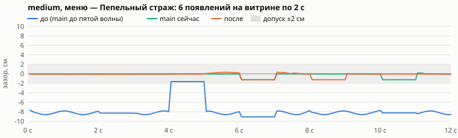
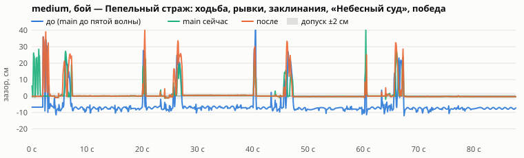
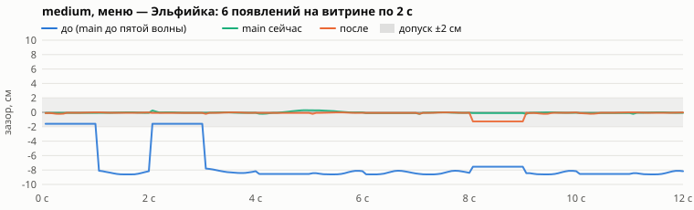
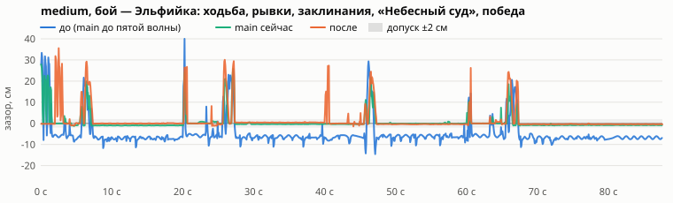
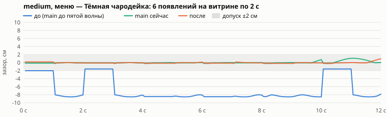
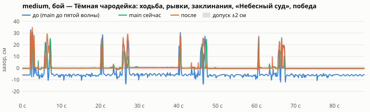
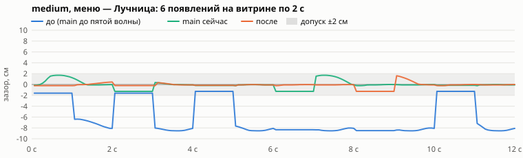
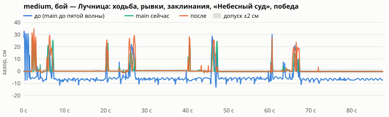
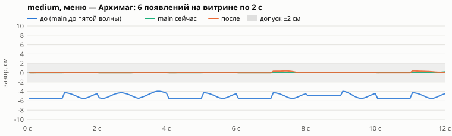
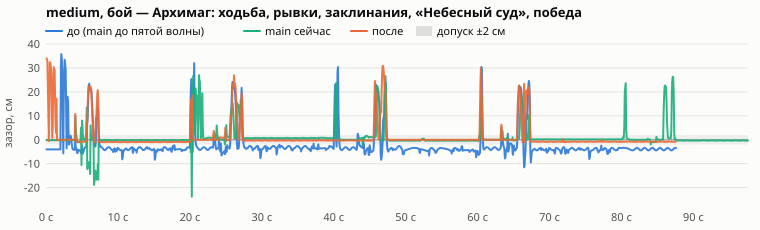

## low

В ячейке: до (main до пятой волны) → **после**, см.

| Сцена | Герой | медиана \|подошва − пол\| | максимум \|подошва − пол\| стоя | глубже всего | кадров глубже 2 см | дрейф стоя: начало … конец |
|---|---|---|---|---|---|---|
| меню, 6 кругов | Пепельный страж | 7.8 → **0.0** | 8.6 → **0.1** | -8.6 → **-0.1** | 67% → **0%** | -5.8…-6.0 → **-0.1…-0.0** |
| меню, 6 кругов | Эльфийка | 8.2 → **0.1** | 8.6 → **1.3** | -8.6 → **-1.3** | 83% → **0%** | -6.1…-8.2 → **-0.1…-0.1** |
| меню, 6 кругов | Тёмная чародейка | 8.0 → **0.1** | 8.5 → **0.2** | -8.5 → **-0.2** | 83% → **0%** | -8.0…-8.1 → **-0.1…-0.1** |
| меню, 6 кругов | Лучница | 8.1 → **0.1** | 8.5 → **1.3** | -8.5 → **-1.3** | 100% → **0%** | -6.0…-8.2 → **-0.5…-0.1** |
| меню, 6 кругов | Архимаг | 5.2 → **0.0** | 5.5 → **1.2** | -5.5 → **-1.2** | 100% → **0%** | -5.3…-4.8 → **-0.4…0.0** |
| бой 2 мин | Пепельный страж | 7.4 → **0.4** | 13.7 → **1.2** | -14.0 → **-2.0** | 91% → **0%** | -7.3…-7.5 → **-0.1…-0.4** |
| бой 2 мин | Эльфийка | 6.1 → **0.4** | 10.6 → **1.3** | -14.6 → **-1.5** | 89% → **0%** | -6.0…-6.3 → **-0.1…-0.4** |
| бой 2 мин | Тёмная чародейка | 5.9 → **0.5** | 10.7 → **1.3** | -15.0 → **-1.2** | 88% → **0%** | -6.1…-6.0 → **-0.1…-0.6** |
| бой 2 мин | Лучница | 6.5 → **0.5** | 11.7 → **1.1** | -13.1 → **-1.3** | 90% → **0%** | -6.6…-6.8 → **-0.7…-0.8** |
| бой 2 мин | Архимаг | 3.6 → **0.3** | 8.5 → **5.0** | -13.1 → **-1.2** | 89% → **0%** | -3.6…-4.2 → **-0.0…-0.3** |
| поражение | Пепельный страж | 10.7 → **0.3** | 22.2 → **0.3** | -22.2 → **-0.3** | 100% → **0%** | -9.9…-10.7 → **-0.2…-0.3** |
| поражение | Эльфийка | 6.2 → **0.1** | 19.5 → **0.1** | -19.5 → **-0.1** | 100% → **0%** | -8.3…-6.2 → **-0.1…-0.0** |
| поражение | Тёмная чародейка | 6.2 → **0.3** | 17.4 → **0.3** | -17.4 → **-0.3** | 100% → **0%** | -8.2…-6.0 → **-0.2…-0.3** |
| поражение | Лучница | 6.8 → **0.1** | 17.4 → **0.1** | -17.4 → **-0.1** | 100% → **0%** | -8.3…-7.0 → **-0.1…-0.0** |
| поражение | Архимаг | 4.0 → **0.2** | 16.1 → **0.3** | -16.1 → **-0.3** | 100% → **0%** | -6.2…-4.0 → **-0.2…-0.3** |

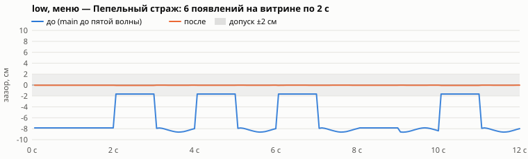
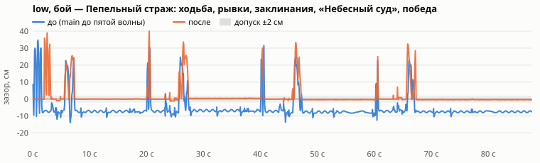
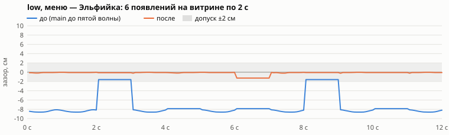
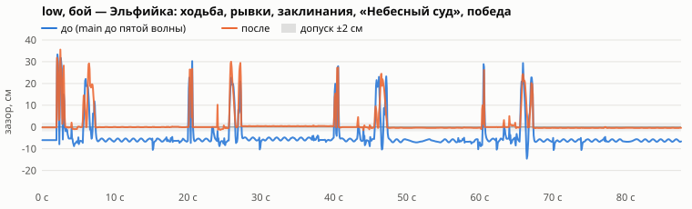
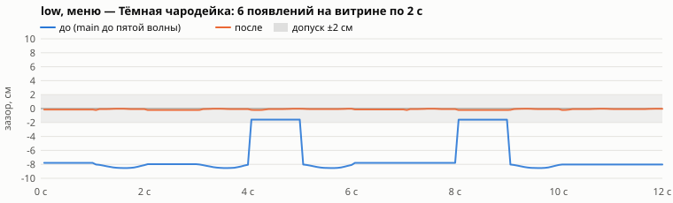
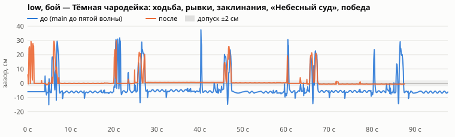
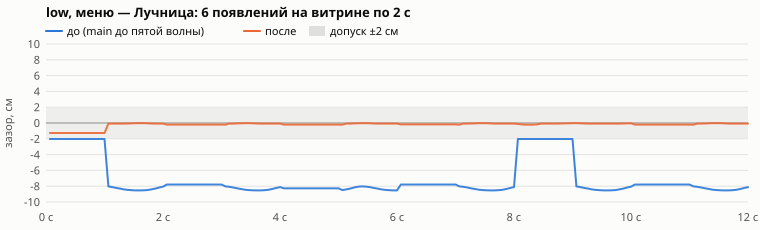
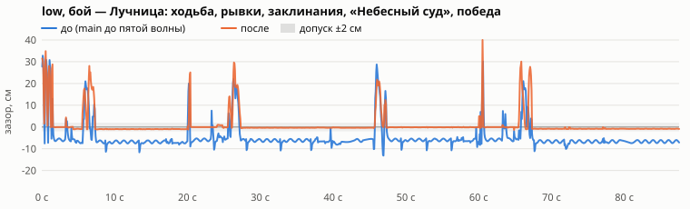
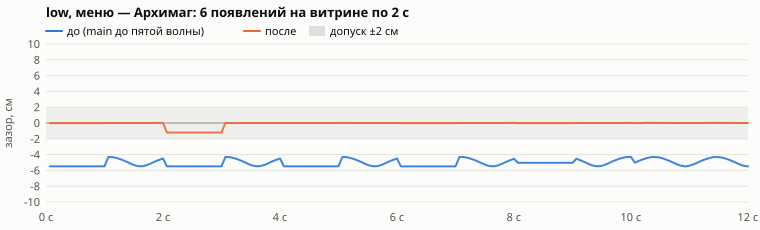
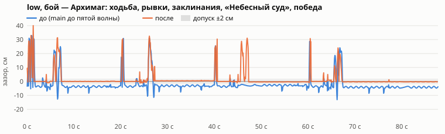

